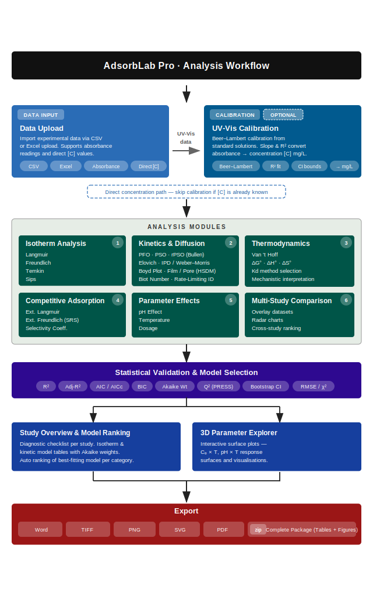

# AdsorbLab Pro

**Professional Adsorption Data Analysis Platform**

[](https://www.python.org/)
[](LICENSE)
[](https://doi.org/10.5281/zenodo.18501799)
[](https://adsorption.streamlit.app)
[](https://github.com/mmalahi00/Adsorption-Analysis-app/actions/workflows/ci.yml)
[](#testing--coverage)

AdsorbLab Pro is a comprehensive, browser-based tool for analyzing adsorption experiments. It fits isotherm and kinetic models using non-linear regression, provides bootstrap confidence intervals, performs rigorous model comparison (R², Adj-R², AIC, AICc, BIC), and generates high-resolution figures and structured Word reports — all without writing a single line of code.

> **Try it now →** [adsorption.streamlit.app](https://adsorption.streamlit.app)

---

## Table of Contents

- [Features](#features)
- [Installation](#installation)
- [Quick Start](#quick-start)
- [Model Equations](#model-equations)
- [Statistical Methods](#statistical-methods)
- [Project Structure](#project-structure)
- [Testing & Coverage](#testing--coverage)
- [Development](#development)
- [Troubleshooting](#troubleshooting)
- [Citation](#citation)
- [License](#license)

---

## Features

### Isotherm Models

| Model | Best for | Parameters |
|-------|----------|------------|
| **Langmuir** | Monolayer, homogeneous surfaces | qₘ, Kₗ |
| **Freundlich** | Heterogeneous surfaces, multilayer | Kf, n |
| **Temkin** | Adsorbate–adsorbate interactions | B₁, Kₜ |
| **Sips** | Heterogeneous at high C, Langmuir at low C | qₘ, Kₛ, nₛ |

### Kinetic Models

| Model | Mechanism | Parameters |
|-------|-----------|------------|
| **Pseudo-First Order** | Physisorption | qₑ, k₁ |
| **Pseudo-Second Order** | Chemisorption | qₑ, k₂, h |
| **Revised PSO** (Bullen et al. 2021) | Concentration-corrected PSO | qₑ, k₂, C₀ |
| **Elovich** | Heterogeneous chemisorption | α, β |
| **Intraparticle Diffusion** | Pore diffusion (Weber-Morris) | kᵢₚ, C |

### Multi-Component Competitive Adsorption

Predict how multiple adsorbates compete for the same binding sites — critical for real wastewater and multi-solute systems.

| Model | Use case |
|-------|----------|
| **Extended Langmuir** (Butler-Ockrent) | Binary/multi-solute systems with known single-component parameters |
| **Extended Freundlich** (SRS) | Heterogeneous surfaces with competition coefficients |

Includes selectivity coefficient (αᵢⱼ) calculation, the ability to link single-component fits or enter parameters manually, per-component bar charts, and automated interpretation of competitive effects.

### 3D Parameter Space Explorer

Visualise how adsorption responds to two variables at once (e.g. Cₑ × T → qₑ, or pH × T → Removal %). Fully interactive Plotly 3D surfaces that can be exported as static images or embedded in the Word report.

### Thermodynamics

Van't Hoff analysis across multiple temperatures yielding ΔG°, ΔH°, and ΔS°.

### Additional Capabilities

- **Calibration** — UV-Vis Beer–Lambert calibration with linearity diagnostics
- **Effect studies** — pH, adsorbent dosage, and temperature optimization
- **Diffusion analysis** — Biot number, Boyd plot, and Weber-Morris multilinearity for rate-limiting step identification
- **Multi-study comparison** across datasets

### Statistical Rigour

- Non-linear regression (not linearized transforms)
- 95 % confidence intervals on all parameters
- Bootstrap CI (500–1000 iterations)
- Model selection via Adj-R², AIC/AICc, BIC, and Akaike weights
- PRESS/Q² leave-one-out cross-validation
- Residual diagnostics (Shapiro-Wilk, Durbin-Watson)

### Export

- **ZIP package** — selected figures (PNG/SVG/PDF) + tables (CSV/XLSX)
- **Word report (.docx)** — embedded figures, formatted tables, captions, and a methods summary

---

## Installation

### System Requirements

| Requirement | Minimum | Recommended |
|-------------|---------|-------------|
| Python | 3.10 | 3.11 or 3.12 |
| RAM | 4 GB | 8 GB |
| Storage | 500 MB | 1 GB |
| OS | Windows 10, macOS 10.14, Ubuntu 20.04 | Latest |

### Streamlit Cloud (no install)

Visit [adsorption.streamlit.app](https://adsorption.streamlit.app) and upload your data.

### Local Install

```bash
# 1. Clone the repository
git clone https://github.com/mmalahi00/Adsorption-Analysis-app.git
cd Adsorption-Analysis-app

# 2. Create and activate a virtual environment
python -m venv venv
source venv/bin/activate      # Linux / macOS
# venv\Scripts\activate       # Windows

# 3. Install dependencies
pip install --upgrade pip
pip install -r requirements.txt

# 4. Launch the app
streamlit run adsorption_app.py
```

The app opens at `http://localhost:8501`.

Alternative launch methods:

```bash
streamlit run adsorblab_pro/app.py   # package entry point
python -m adsorblab_pro              # module mode
pip install -e . && adsorblab        # CLI shortcut after editable install
```

### Docker

```bash
docker compose up --build          # production on port 8501
docker compose --profile dev up    # dev mode with hot-reload on port 8502
```

---

## Quick Start

<p align="center">
  
</p>

### Example Data

The `examples/` directory contains ready-to-use datasets for every tab, in both Standard (absorbance) and Direct (concentration) modes. `expected_results.json` provides validation benchmarks.

---

## Model Equations

### Isotherm Models

**Langmuir (1918)** — monolayer adsorption on a homogeneous surface with finite identical sites.

```
qₑ = (qₘ · Kₗ · Cₑ) / (1 + Kₗ · Cₑ)
```

Separation factor Rₗ = 1/(1 + Kₗ·C₀): Rₗ = 0 irreversible, 0 < Rₗ < 1 favourable, Rₗ = 1 linear, Rₗ > 1 unfavourable.

**Freundlich (1906)** — heterogeneous surfaces with non-uniform energy distribution.

```
qₑ = Kf · Cₑ^(1/n)
```

n > 1 favourable, n = 1 linear, n < 1 unfavourable.

**Temkin (1940)** — heat of adsorption decreases linearly with coverage.

```
qₑ = B₁ · ln(Kₜ · Cₑ)        where B₁ = RT / bₜ
```

**Sips (Langmuir-Freundlich)** — hybrid; reduces to Langmuir when nₛ = 1.

```
qₑ = qₘ · (Kₛ · Cₑ)^nₛ / [1 + (Kₛ · Cₑ)^nₛ]
```

### Kinetic Models

**Pseudo-First Order (Lagergren 1898)**

```
qₜ = qₑ · (1 − e^(−k₁·t))
```

**Pseudo-Second Order (Ho & McKay 1999)**

```
qₜ = (qₑ² · k₂ · t) / (1 + qₑ · k₂ · t)        h = k₂ · qₑ²  (initial rate)
```

**Elovich**

```
qₜ = (1/β) · ln(1 + α·β·t)
```

**Intraparticle Diffusion (Weber-Morris)**

```
qₜ = kᵢₚ · √t + C
```

If C = 0, intraparticle diffusion is the sole rate-limiting step.

### Thermodynamics

**Van't Hoff:**  `ln(Kd) = ΔS°/R − ΔH°/(RT)` — plot ln(Kd) vs 1/T to obtain slope = −ΔH°/R and intercept = ΔS°/R.

**Gibbs free energy:**  `ΔG° = −RT·ln(Kd) = ΔH° − T·ΔS°`

---

## Statistical Methods

| Criterion | Purpose |
|-----------|---------|
| R² | Goodness of fit (0–1) |
| Adj. R² | Penalises extra parameters |
| AIC / AICc | Model selection (lower = better); AICc for small samples |
| BIC | Stricter parameter penalty than AIC |
| Q² (PRESS) | Predictive ability via leave-one-out cross-validation |

**Bootstrap confidence intervals** — residuals are resampled 500–1000 times; the model is refit each iteration and the 2.5th/97.5th percentiles are reported.

**PRESS / Q²:**

```
PRESS = Σ(yᵢ − ŷᵢ₍₋ᵢ₎)²
Q²    = 1 − PRESS / SStot
```

Q² > 0.5 indicates good predictive ability.

---

## Project Structure

```
Adsorption-Analysis-app/
├── adsorption_app.py              # Root Streamlit launcher
├── adsorblab_pro/
│   ├── app.py                     # Streamlit entry point
│   ├── app_main.py                # Main UI and routing
│   ├── config.py                  # Constants and configuration
│   ├── models.py                  # Isotherm and kinetic models
│   ├── utils.py                   # Calculations, bootstrap, statistics
│   ├── validation.py              # Input validation and diagnostics
│   ├── sidebar_ui.py              # Sidebar controls
│   ├── plot_style.py              # High-resolution plot styling
│   ├── docx_report.py             # Word report generator
│   ├── streamlit_compat.py        # Streamlit compatibility shim
│   └── tabs/                      # One module per analysis tab
│       ├── home_tab.py
│       ├── calibration_tab.py
│       ├── isotherm_tab.py
│       ├── kinetic_tab.py
│       ├── thermodynamics_tab.py
│       ├── temperature_tab.py
│       ├── ph_effect_tab.py
│       ├── dosage_tab.py
│       ├── competitive_tab.py
│       ├── comparison_tab.py
│       ├── statistical_summary_tab.py
│       ├── threed_explorer_tab.py
│       └── report_tab.py
├── examples/                      # Sample datasets
├── tests/                         # Test suite
│   ├── test_models.py             # Isotherm & kinetic model tests
│   ├── test_models_extended.py    # Extended model edge cases
│   ├── test_utils.py              # Utility function tests
│   ├── test_utils_extended.py     # Extended utility tests
│   ├── test_validation.py         # Input validation tests
│   ├── test_validation_extended.py # Extended validation tests
│   ├── test_config_extended.py    # Configuration tests
│   ├── test_coverage.py           # Extended coverage tests
│   ├── test_tab_calculations.py   # Tab computation logic tests
│   ├── test_report_generators.py  # Report figure & table tests
│   ├── test_integration.py        # End-to-end workflow tests
│   ├── test_ui_streamlit.py       # UI module import & smoke tests
│   ├── test_performance.py        # Fitting performance benchmarks
│   ├── test_docx_report.py        # Word report generation tests
│   ├── test_docx_report_extended.py # Extended report tests
│   ├── test_plot_style_extended.py  # Plot styling tests
│   └── test_thermo_error_propagation.py # Thermodynamic error propagation tests
├── docs/
│   └── USER_GUIDE.md
├── scripts/                       # Cleanup utilities
├── pyproject.toml
├── requirements.txt
├── requirements-dev.txt
├── requirements-lock.txt
├── Dockerfile
├── docker-compose.yml
├── CITATION.cff
├── CONTRIBUTING.md
├── CODE_OF_CONDUCT.md
├── SECURITY.md
└── LICENSE
```

---

## Testing & Coverage

AdsorbLab Pro has a comprehensive test suite enforced in CI on every push and pull request.

### Test Suite Overview

| Test File | Tests | What It Covers |
|-----------|------:|----------------|
| `test_coverage.py` | 179 | Extended coverage across config, plotting, statistics, models |
| `test_utils.py` | 178 | Utility functions: calculations, bootstrap, error metrics, residuals |
| `test_utils_extended.py` | 102 | Extended utility edge cases and helpers |
| `test_validation_extended.py` | 88 | Extended validation edge cases |
| `test_models_extended.py` | 76 | Extended model edge cases and numerical stability |
| `test_report_generators.py` | 71 | Report tab: figure generation, table generation, edge cases |
| `test_models.py` | 65 | Isotherm & kinetic model functions, fitting, numerical stability |
| `test_validation.py` | 58 | Input validation: positive/range/array/dataframe validators |
| `test_tab_calculations.py` | 51 | Tab computation logic: isotherm, kinetic, dosage, pH, thermodynamics |
| `test_ui_streamlit.py` | 43 | UI module imports, config structure, plot style smoke tests |
| `test_plot_style_extended.py` | 39 | Plot styling, export formatting, and layout tests |
| `test_integration.py` | 37 | End-to-end workflows combining models + validation + statistics |
| `test_config_extended.py` | 33 | Configuration constants, session keys, and defaults |
| `test_thermo_error_propagation.py` | 26 | Thermodynamic error propagation and uncertainty analysis |
| `test_performance.py` | 9 | Fitting speed benchmarks (Langmuir, Freundlich, Sips, PSO) |
| `test_docx_report_extended.py` | 2 | Extended Word report edge cases |
| `test_docx_report.py` | 1 | Word report generation produces valid .docx |
| **Total** | **1058** | |

### Running Tests

```bash
# Run the full suite with coverage (uses pyproject.toml config)
pytest

# Run a specific test file
pytest tests/test_models.py -v

# Run tests matching a keyword
pytest -k "isotherm" -v

# Skip slow tests
pytest -m "not slow"
```

Coverage is collected automatically via `pyproject.toml` — every `pytest` invocation produces a terminal summary and an HTML report in `htmlcov/`.

### Coverage Configuration

Coverage enforcement is configured in `pyproject.toml`:

```toml
[tool.pytest.ini_options]
addopts = [
    "--cov=adsorblab_pro",
    "--cov-report=term-missing:skip-covered",
    "--cov-report=html:htmlcov",
    "--cov-fail-under=65",
]

[tool.coverage.run]
source = ["adsorblab_pro"]
branch = true

[tool.coverage.report]
fail_under = 65
show_missing = true
```

The minimum threshold (`fail_under`) is a CI gate — `pytest` exits non-zero if line coverage drops below the threshold. The HTML report in `htmlcov/index.html` shows per-file, per-line miss detail for identifying gaps.

### Coverage Architecture

The test suite is structured in layers:

- **Core logic** (models, utils, validation, config) — deeply tested with correctness assertions, edge cases, and numerical stability checks.
- **Tab calculations** (isotherm_tab, kinetic_tab, dosage_tab, ph_effect_tab, thermodynamics_tab) — the pure computation functions (`_calculate_*_results`, `_calculate_kd`) are tested independently of Streamlit. This is possible because `streamlit_compat.py` provides a no-op stub for `@st.cache_data` in test environments.
- **Report generators** (report_tab) — all 28+ `_gen_*` figure and table generators are tested with mock `study_state` dictionaries. Multi-study generators use `unittest.mock.patch` to inject session state.
- **UI smoke tests** — verify every tab module imports cleanly and exposes its `render()` function.
- **Integration** — end-to-end workflows that chain calibration → isotherm fitting → bootstrap CI → model comparison.

### CI Pipeline

The GitHub Actions workflow (`.github/workflows/ci.yml`) runs five parallel jobs:

1. **Lint** — `ruff check` and `ruff format --check`
2. **Type check** — `mypy adsorblab_pro/`
3. **Test** — `pytest` across Python 3.10, 3.11, 3.12
4. **Coverage** — `pytest --cov --cov-fail-under` with Codecov upload
5. **Security** — `pip-audit` for known vulnerabilities

All four core jobs (lint, typecheck, test, coverage) must pass before a PR can merge. The security audit runs independently.

---

## Development

```bash
# Install runtime + dev dependencies
pip install -r requirements.txt -r requirements-dev.txt

# Run the full test suite (coverage collected automatically)
pytest

# Run without coverage (faster iteration)
pytest --no-cov tests/test_models.py -v

# Lint
ruff check .

# Type checking
mypy adsorblab_pro/
```

For reproducible builds, use `requirements-lock.txt`. See [CONTRIBUTING.md](CONTRIBUTING.md) for full guidelines.

### Production Deployment

Before packaging or deploying from a ZIP checkout, clean build/test artefacts:

```bash
bash scripts/clean_artifacts.sh                                       # macOS / Linux
powershell -ExecutionPolicy Bypass -File scripts/clean_artifacts.ps1  # Windows
```

---

## Troubleshooting

**pip install fails with compilation errors**

```bash
# Windows: install Visual C++ Build Tools
# macOS:   xcode-select --install
# Linux:   sudo apt-get install build-essential python3-dev
```

**Port 8501 already in use**

```bash
streamlit run adsorption_app.py --server.port 8502
```

**DOCX export option is disabled** — install the dependency and restart Streamlit: `pip install python-docx`. If you see an lxml ImportError, run `pip install -U pip setuptools wheel`.

**Fitting fails to converge** — check for outliers, verify Cₑ < C₀, try a simpler model first, or adjust initial parameter guesses.

**Bootstrap CI very wide** — ensure at least 6–8 data points, check for outliers, and consider whether the chosen model is appropriate.

### Data Quality Checklist

- Cₑ ≤ C₀ for all points
- No negative concentrations or capacities
- ≥ 5 points for isotherms, ≥ 8 for kinetics
- Consistent units (mg/L, g, L, min)
- Temperature in Kelvin for thermodynamic analysis

---

## Citation

If you use AdsorbLab Pro in your research, please cite:

```bibtex
@software{adsorblab_pro_2026,
  title   = {{AdsorbLab Pro}: Professional Adsorption Data Analysis Platform},
  author  = {{Mohamed EL MALLAHI}},
  year    = {2026},
  version = {2.0.0},
  url     = {https://github.com/mmalahi00/Adsorption-Analysis-app},
  doi     = {10.5281/zenodo.18501799},
  license = {MIT}
}
```

---

## License

[MIT](LICENSE) © Mohamed EL MALLAHI

---

## Support

- [Report a bug](https://github.com/mmalahi00/Adsorption-Analysis-app/issues)
- [Request a feature](https://github.com/mmalahi00/Adsorption-Analysis-app/issues)